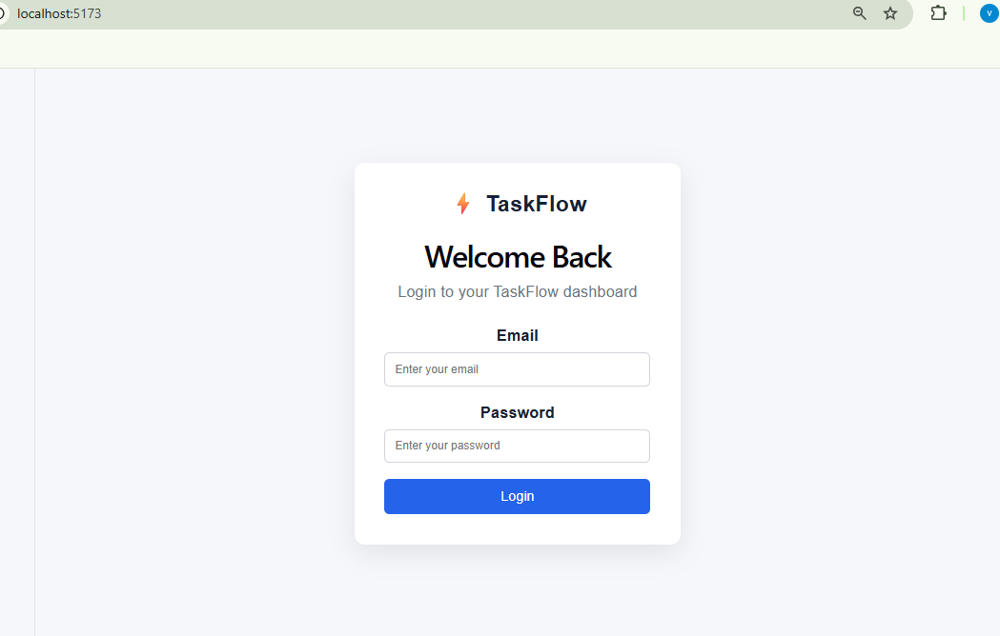
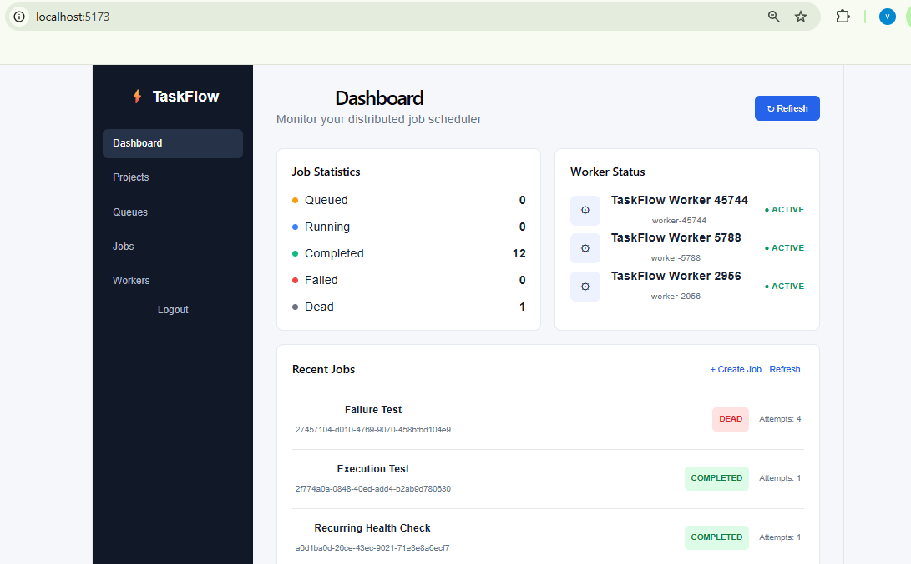
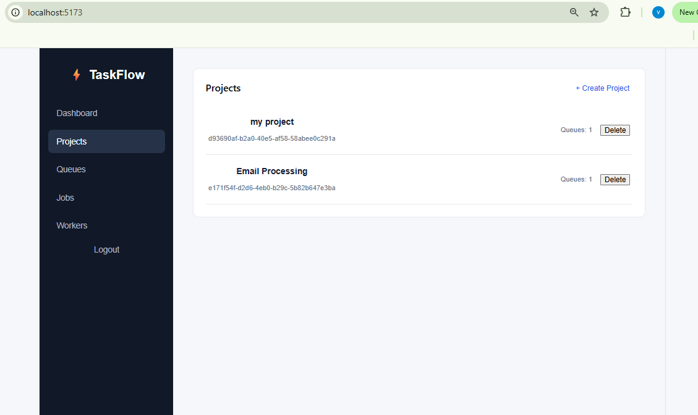
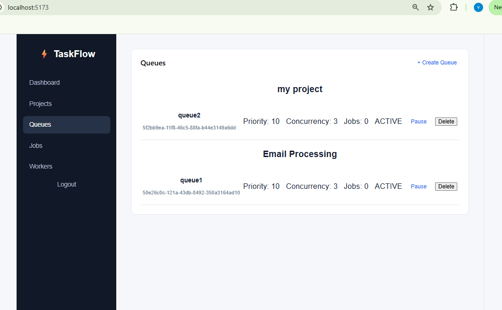
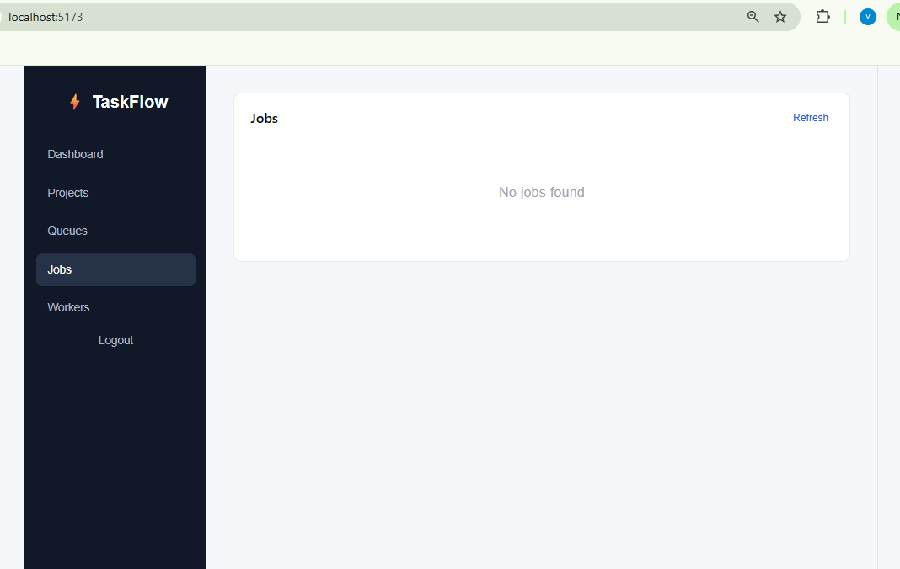
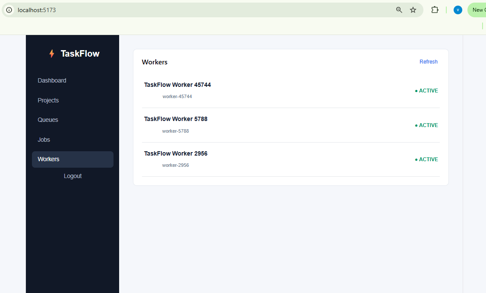

# ⚡ TaskFlow

### Distributed Job Scheduling & Processing System

TaskFlow is a full-stack distributed job scheduler designed to create, manage, schedule, and process jobs across multiple workers.

It provides a centralized dashboard for managing **Projects, Queues, Jobs, and Workers**, while the backend exposes REST APIs and the infrastructure required for distributed job processing — including priority handling, retries, scheduling, and fault tolerance.

---

## 🚧 Project Status

> **Currently in development**
> Core dashboard, authentication, and CRUD APIs are complete. The distributed worker engine — job claiming, execution, retries, and fault tolerance — is actively being built.

---

## ✨ Features

- 🔐 JWT-based authentication (register, login, protected routes)
- 📁 Project-based organization for queues and jobs
- 📊 Configurable queues — priority, concurrency, retry strategy, pause/resume
- 🧾 Job creation with payload, priority, scheduling, and retry limits
- 📈 Live dashboard stats — projects, queues, jobs, workers
- 🛰️ Worker monitoring endpoint
- 🧱 Clean REST API with auth middleware and ownership checks

---

## 🧩 Tech Stack

| Layer | Technologies |
|---|---|
| **Frontend** | React.js, TypeScript, Vite, Axios, React Hooks |
| **Backend** | Node.js, Express.js, TypeScript, JWT, bcrypt |
| **Database** | SQLite (dev), Prisma ORM |
| **Tooling** | Git, GitHub, Postman, VS Code, Chrome DevTools |

---

## 📸 Screenshots

### 🔐 1. Login

User authentication screen for securely accessing TaskFlow.

<p align="center">
  
</p>

---

### 📊 2. Dashboard

Central dashboard showing projects, queues, jobs, job statistics, and workers.

<p align="center">
  
</p>

---

### 📁 3. Project Management

Create, view, and manage projects and their associated queues.

<p align="center">
  
</p>

---

### 📋 4. Queue Management

View queues, configure processing settings, and manage queue states such as **Pause / Resume**.

<p align="center">
  
</p>

---

### 📝 5. Job Management

View and manage jobs created inside queues, including job status, priority, and attempts.

<p align="center">
  
</p>

---

### 👷 6. Worker Monitoring

Monitor registered workers responsible for processing distributed jobs.

<p align="center">
  
</p>

---

## 🏗️ Architecture

**Current (client-server):**

```
React Frontend
      ↓
Axios REST Requests
      ↓
Express.js Backend
      ↓
Auth Middleware
      ↓
Controllers
      ↓
Prisma ORM
      ↓
Database
```

**Planned (distributed processing):**

```
User → Dashboard → TaskFlow API → Job Queue / DB → Multiple Workers → Job Execution → Status Update
```

---

## 📦 Core Concepts

### Project
A logical container for queues, used to organize jobs by application or workload.

```
Project: Email Processing
  ├── emailQueue
  ├── notificationQueue
  └── retryQueue
```

### Queue
Belongs to a project and holds jobs waiting to be processed.

- Priority · Concurrency · Retry strategy · Max retries · Retry delay
- States: `ACTIVE` / `PAUSED` — a paused queue blocks new job processing

### Job
A unit of work with an ID, name, JSON payload, priority, status, attempts, and schedule.

```json
{
  "name": "Send Welcome Email",
  "payload": { "email": "user@example.com" },
  "priority": 10
}
```

### Job Lifecycle

```
QUEUED → RUNNING → COMPLETED
                 ↘ FAILED → RETRY → RUNNING → ... → DEAD (if max retries exceeded)
```

Scheduled jobs additionally pass through `SCHEDULED → QUEUED`.

### Worker
Executes jobs and, in the planned distributed model, will:

- Register with the system and receive a unique ID
- Send periodic heartbeats
- Fetch, claim, and execute jobs
- Report results and handle failures
- Recover from crashes via stale-worker detection

```
        TaskFlow Backend
              |
        Job Queue / DB
        /     |      \
   Worker 1 Worker 2 Worker 3
      |        |        |
    Job A    Job B    Job C
```

---

## 🖥️ Dashboard

`Dashboard` · `Projects` · `Queues` · `Jobs` · `Workers` · `Logout`

| Page | Capabilities |
|---|---|
| **Dashboard** | Counts, job stats, recent jobs, worker info |
| **Projects** | Create, view, open, delete |
| **Queues** | Create, configure, pause/resume, delete |
| **Jobs** | Create, view status/priority/attempts, refresh |
| **Workers** | View live worker information |

---

## 🔐 Authentication

JWT-based, with token auto-attached on every request:

```
User → Login → Credentials validated → JWT issued
     → Token stored client-side → Axios interceptor attaches it
     → Authorization: Bearer <token> → Auth middleware → Controller
```

---

## 🔌 API Overview

```
/api/auth        → register, login
/api/projects    → project CRUD
/api/queues      → queue CRUD, pause/resume
/api/jobs        → job CRUD
/api/workers     → worker info
/api/dashboard   → aggregate stats
```

**Examples:**

```
POST   /api/projects
GET    /api/projects
DELETE /api/projects/:id

POST   /api/queues/project/:projectId
PATCH  /api/queues/:id
POST   /api/queues/:id/pause
POST   /api/queues/:id/resume

POST   /api/jobs/queue/:queueId
GET    /api/jobs/queue/:queueId

GET    /api/workers
GET    /api/dashboard
```

---

## 🗂️ Database Schema

```
User
 └── Projects
       └── Queues
             └── Jobs
```

Workers exist independently and interact with jobs/queues at runtime. Managed via Prisma ORM.

---

## 📁 Project Structure

```
taskflow/
├── backend/
│   ├── prisma/schema.prisma
│   ├── src/
│   │   ├── config/
│   │   ├── controllers/
│   │   ├── middleware/
│   │   ├── routes/
│   │   └── server.ts
│   └── package.json
├── frontend/
│   ├── src/
│   │   ├── services/
│   │   ├── Dashboard.tsx
│   │   ├── App.tsx
│   │   └── main.tsx
│   └── package.json
└── README.md
```

---

## 🚀 Getting Started

**Prerequisites:** Node.js, npm, Git

```bash
git clone https://github.com/<your-username>/taskflow.git
cd taskflow

# Backend setup
cd backend
npm install
npx prisma migrate dev
npx prisma generate
npm run dev

# Frontend setup (new terminal)
cd frontend
npm install
npm run dev
```

| Service | URL |
|---|---|
| Frontend | `http://localhost:5173` |
| Backend | `http://localhost:5000` |

---

## ✅ Completed

Auth · Project/Queue/Job CRUD · Pause/resume · Priority & payload handling · Delayed & scheduled jobs · Retry config · Dashboard stats · Worker info endpoint · Axios + JWT interceptor

## 🔜 In Progress

Worker service · Job claiming/locking · Execution engine · Automatic retry processing · Concurrency limits · Heartbeats & stale-worker recovery · Real-time monitoring (WebSockets/SSE)

## 🗺️ Roadmap

- Redis-backed queue
- Worker auto-scaling & Dockerized workers
- Cron-style & recurring jobs
- Dead-letter queues, job logs, execution history
- Rate limiting & job timeouts
- Prometheus/Grafana metrics
- Docker Compose & cloud deployment

---

## 🎯 Goal

Evolve TaskFlow from a job-management dashboard into a reliable **distributed job processing platform** — demonstrating concurrency, fault tolerance, scheduling, and worker coordination at scale.

---

## 🤝 Contributing

Issues and pull requests are welcome. For major changes, please open an issue first to discuss what you'd like to change.

## 📄 License

Licensed under the [MIT License](LICENSE).
